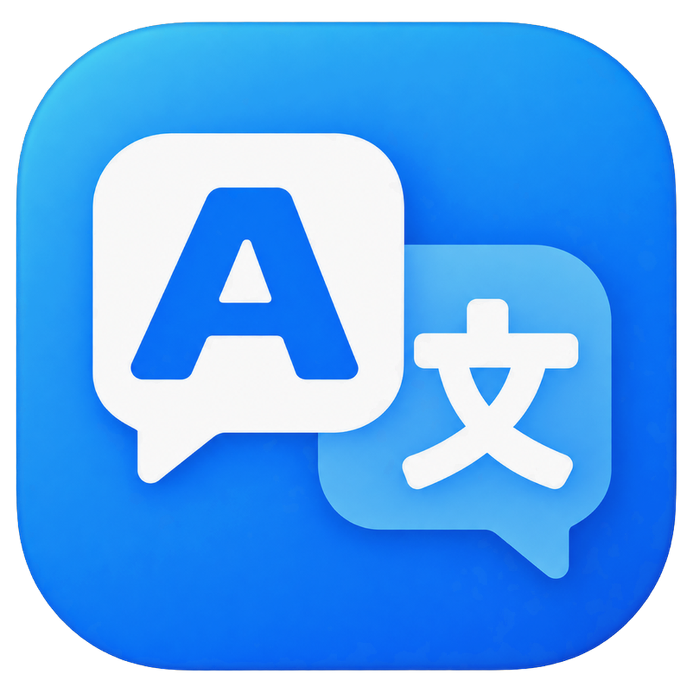

# 语桥 Bridgo

<p align="center">
  
</p>

<p align="center">
  一款面向 Windows 的轻量桌面翻译工具，支持文本翻译和截图翻译。
</p>

<p align="center">
  <a href="https://github.com/huwenyang12/LightTranslator/releases/latest">
    
  </a>
  
  
</p>

## 项目简介

语桥 Bridgo 将常用的文本翻译和截图翻译整合在一个简洁的 Windows 桌面应用中。应用常驻系统托盘，可通过自定义全局快捷键快速唤起，适合日常阅读、学习和跨语言沟通。

截图识别由本地 PP-OCRv5 模型完成，文本翻译由 DeepSeek API 提供。

## 功能特性

- **文本翻译**：输入文本后自动翻译，支持中文、English 和日本語。
- **截图翻译**：框选屏幕区域，识别文字并按原始布局展示译文。
- **混合语言处理**：自动跳过已经是目标语言的截图区域，减少重复覆盖。
- **全局快捷键**：文本翻译和截图翻译均可独立设置快捷键。
- **系统托盘**：关闭窗口后可继续在后台运行，并从托盘打开设置。
- **偏好记忆**：保留语言方向、快捷键及文本翻译窗口的位置和大小。
- **开机启动**：可选择登录 Windows 后自动运行。
- **密钥保护**：DeepSeek API Key 使用 Windows DPAPI 加密，仅保存在当前 Windows 用户下。

## 界面预览

### 文本翻译


### 截图翻译


### 设置


## 下载与安装

1. 打开 [Releases](https://github.com/huwenyang12/LightTranslator/releases/latest)。
2. 下载最新的 `Bridgo-*-win-x64.zip`。
3. 将压缩包完整解压到任意目录。
4. 运行 `Bridgo.exe`。

> 语桥目前提供 Windows x64 版本。压缩包已包含 .NET 运行时和 OCR 模型，不需要另行安装 .NET。

## 首次使用

1. 准备可用的 DeepSeek API Key。
2. 打开语桥的设置页，填入 API Key 并点击“测试连接”。
3. 为文本翻译和截图翻译设置不冲突的全局快捷键。
4. 根据需要设置截图翻译的源语言、目标语言和开机启动。

快捷键可自由配置。例如：

- `Alt + T`：唤起文本翻译窗口。
- `Alt + Q`：进入截图框选。

> 以上只是配置示例，新安装的默认快捷键为空，需在设置页中指定。

### 文本翻译操作

- 输入文本后会自动开始翻译。
- 翻译完成后按 `Enter` 可复制译文并关闭窗口。
- 按 `Shift + Enter` 可在输入框中换行。
- 按 `Esc` 可关闭窗口。

### 截图翻译操作

- 按下已设置的截图翻译快捷键。
- 拖动鼠标框选需要翻译的屏幕区域。
- 等待本地 OCR 识别和在线翻译完成。
- 按 `Esc` 可取消框选或关闭结果窗口。

## 数据与隐私

- 截图 OCR 在本地通过 PP-OCRv5 和 ONNX Runtime 执行。
- 识别后的待翻译文本会发送给 DeepSeek API。
- API Key 通过 Windows DPAPI 加密，保存于当前用户的本地应用数据目录。
- 普通设置和日志保存于 `%LocalAppData%\Bridgo`。

## 开发与构建

### 环境要求

- Windows 10/11
- [.NET 8 SDK](https://dotnet.microsoft.com/download/dotnet/8.0)

### 本地构建

```powershell
git clone https://github.com/huwenyang12/LightTranslator.git
cd LightTranslator
dotnet restore
dotnet build LightTranslator.sln -c Release
```

### 运行测试

```powershell
dotnet test LightTranslator.sln -c Release
```

## 项目结构

```text
LightTranslator.sln
├─ src/LightTranslator/          # WPF 桌面应用
├─ tests/LightTranslator.Tests/ # 自动化测试
├─ tools/                       # OCR 模型准备工具
└─ docs/                        # 设计与验收文档
```

## 问题反馈

如果遇到翻译失败、OCR 识别异常、快捷键冲突或界面显示问题，请在 [Issues](https://github.com/huwenyang12/LightTranslator/issues) 中提交反馈，并尽量附上：

- Windows 版本。
- 语桥版本。
- 复现步骤和相关截图。
- 需要时附上 `%LocalAppData%\Bridgo\logs\app.log`（提交前请检查并移除隐私信息）。

## 版本记录

各版本更新内容请查看 [Releases](https://github.com/huwenyang12/LightTranslator/releases)。
